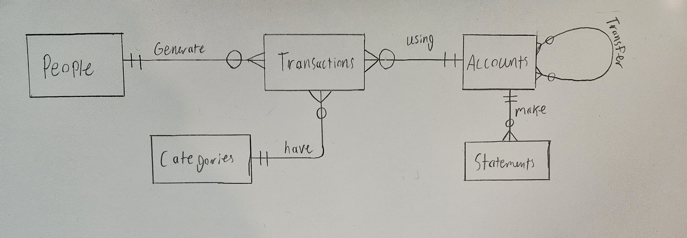

# Design Document - Household Finance Database

By Noah Beach

Github: NoahBeach-06

edX: nrjb06

Smiths Falls, Canada

16/01/2026

Video overview: <https://youtu.be/2JGdxL_rlRc>

## Scope

* The purpose of this database is to manage household finances. It tracks all the people spending money, the accounts sending, spending, or receiving funds, all the expenses, etc. This effectively allows a user to track their finances.

* Included in the scope of this database are the people spending and earning money, the accounts, any transactions, expenses, transfers, and categories of spending. It effectively tracks all money going in and all money going out, along with where, why, and from whom.

* Outside the scope of this database are tools for budgeting, such as each account's balance (though it can be found through a view), and any theoretical, planned, or expected expenses. This tool is not meant for planning budgets; it is only meant for tracking what has already happened.

## Functional Requirements

* A user should be able to do many things with this database. Firstly, a user should be able to enter how much money they made, and which account it was added to, through a unique ID. They can add anything they purchased, how much it cost, and when it was purchased. They can track any transfers between accounts, and between other people in the household, and have it all automatically update in a master statements table. These entities being tracked allow for easily determining household wealth, total expenses during a certain time period, total income during a certain time period, total transfers, who is spending or making the most, etc.

* As mentioned in the scope section, the user should not be able to plan for expenses or income. There is no option to create a budget, or to set spending goals, etc. This database is not meant to be a finance planning tool; it is meant to be a finance tracking tool.

## Representation

### Entities

People
People have been given a primary key "id" which is an integer, a name which is text, and a job which is text. All of the tables in this database have an integer id, which I felt was good for consistency and easy identifiability of certain events. The name was essential for easily determining who is making or spending what, without memorizing which person in the household belonged to which id. The job field is not strictly necessary, but I thought it was a nice touch to completely round out the people table in order to provide a fuller picture of who was bringing in money.

Transactions
Transactions have a primary key id, which is also an integer, the person_id field, which references the People table, an account_id field, which references a soon-to-be-mentioned accounts table, an amount, which is a NUMERIC, a date, which is a NUMERIC, and a category_id, which references a categories table. Transactions in this database track money going into or out of the household as a whole, not between accounts, which is why only one account id field is needed. I thought that when a transaction was made, it was essential that each transaction had a unique id, and the person who did it, the account from which it was done, the amount which it was, and the date it was made. The category id will track if it was an expense or income, and what type it was (work income, school expense, etc). This was separated from the transactions table in order that there would be future expandability for tracking the expenses and income, and to separately track what types of things were being bought, and what type of income was being brought in, etc.

Categories
Again, the categories table has an integer id. It also has a name field and a type field, which are both text fields. The name is meant to be a unique name that tracks the type of income or expense (gas, car repair, work income, etc). The type field can either be 'Income' or 'Expense'.

Accounts
This has an integer id field, which is separate from the account_number field, which is also an integer. This is strictly a style thing, and while it would be possible for the account_number to be the primary key, I felt it necessary to separate the two fields. This table also has a name to identify it easily, and it also has a text field type, which can take on one of many account types, including 'Chequing', 'Saving', 'Debit', 'Credit' and 'Investment'. More can be added in the future if need be; these were added to cover the basics for household finances.

Transfers
This transfer table is meant to track intra-household transactions. It has a unique id field to identify each transfer, and it has 2 account_id fields, one for from_account_id and one for to_account_id, which reference two separate accounts (which cannot be equal) to track what money is going from what account to what account. It also has a numeric amount and a numeric date field.

Statements
This is meant to be the master record for all the money moving around in the household. It has a unique id field, which is its primary key, an account_id field, which references the account from which money was added or removed, a numeric amount field, a type field which can be a 'Transaction', 'Transfer_in' or 'Transfer_out', and a date for the statement.

More importantly, this table has 3 triggers that activate when a transaction is made or when a transfer is made. When a transfer is made, 2 triggers are activated, one to update the statements table for the account losing the money, and one for the account gaining the money. This is so that whenever an overall, or by account balance is required, it can be easily determined through the statements table.

### Relationships

People - Transactions
This relationship is modelled through the fact that people generate transactions. Though people can generate no, one, or many transactions, every transaction must belong to one person and one person only.

Transactions - Accounts
This relationship is modelled through the fact that transactions are generated using accounts. Each transaction is generated by only one account, but one account could have no transactions or many transactions associated with it.

Transactions - Categories
Each transaction has a certain category. Though multiple transactions could belong to the same category (you need to fill up with gas more than once), each transaction must belong to only one category.

Accounts - Statements
Every account transaction generates a statement. Again, one account could have no, one, or many statements associated with it; each statement only ever belongs to one account.

Accounts - Accounts
Accounts can transfer money to other accounts through the transfer table. Each account can transfer to one, no, or many accounts, and each account can have one, no, or many accounts transferring to it.

## Optimizations

"balances" view:
This view was created to show the total balance of every account in the database. This was created because this seemed like a really common thing that would need to be checked, but it required a more complex query to get it. It joins two tables together, groups by each account, and then orders by greatest balance to lowest balance. It is easy to check the balance by looking at this view.

All three of the created indexes "send_lookup", "statements_lookup" and "transaction_lookup" were created for the same purpose - for easy lookup of how money is moving.

On all three of the tables for which the indexes were created ("send_funds", "statements", "transactions"), the same general columns were affected - the account id(s), the amount of money moved, and the date. For the statement lookup, the type was also added, and for the transactions lookup, the category_id was also added.

This general form allows any movement of money to be quickly tracked by either the account number, the date it was made, the amount of money, or the type of transactions, where applicable. These were deemed to be common query types and therefore were indexed for swifter lookup.

## Limitations

This design, though able to effectively track many transactions, does have some notable limitations. When a transaction is labelled as an expense, the amount must also be entered as a negative number. This could be confusing and is extra work to get data effectively and correctly entered into the database. When someone labels something as an expense and enters a positive number, it is a reasonable assumption that the positive amount would be subtracted.

Furthermore, it is not able to plan for budgeting. This would require a new set of tables for planned expenses, or a new 'planned' column in the expenses table. Either way, it was deemed outside the scope of this project, and thus the database is not able to represent future theoretical expenses, income, etc very well.
